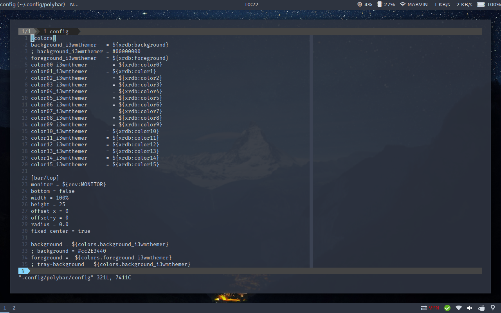

# dotfiles
You know the drill.

## macOS
Tiling via ~~kwm~~ [chunkwm](https://github.com/koekeishiya/chunkwm) and
[khd](https://github.com/koekeishiya/khd).

## Arch Linux on a MacBook Pro 2011
i3wm, polybar, rofi, termite, neovim, ncmcpp + mpd

